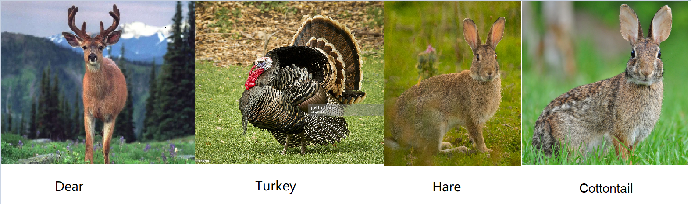
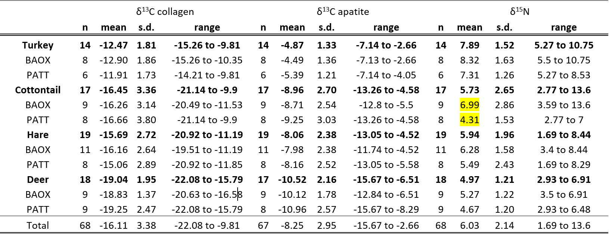

```{r setup, include=FALSE}
knitr::opts_chunk$set(echo = FALSE)
```

## Client

- Client: Maria Codlin

- Department: Department of Anthropology

## Project Description

- Overall goal 

- Understand role of animals in ancient economy at Teotihuacan Mexico.
<!-- were animals hunted from natural environments, anthropogenic environments, or raised for consumption in the city? -->

<br/>

- Specific goals

-	Animals from BOAX and PATT had similar diets 
<!-- (only Nitrogen values for cottontails differ between BOAX and PATT) -->

-	Cottontails have two or more distinct diets

## Data and explaination

- Variables

- "Taxa", "Site" and "Carbon and Nitrogen Level"

<br/>

- "Taxa" : turkey, cottontails, deer, and hare


- "Site" : BOAX, PATT  (two closely related sites)

```{r pictures, echo=FALSE, out.width = '90%'}

```

## Carbon and Nitrogen Level

- stable carbon and nitrogen isotopes 

- These enter bones by eating and reflect the isotopic values of food sources. 

<br/>

-	Carbon isotopes -- level of human-grown plants in the diet
<!-- , such as maize (corn).  -->
 <!-- High values = more corn.  -->

- Carbon isotopes from collagen are protein derived.
- Carbon isotopes from apatite (carbonate) reflect whole diet. 

<br/>

-	Nitrogen isotopes tell us about the protein in the diet. 
<!-- Higher values = more protein.  -->


## Summary statistics

```{r summary_data, echo=FALSE, out.width = '100%'}

```

## Goal and Plan


